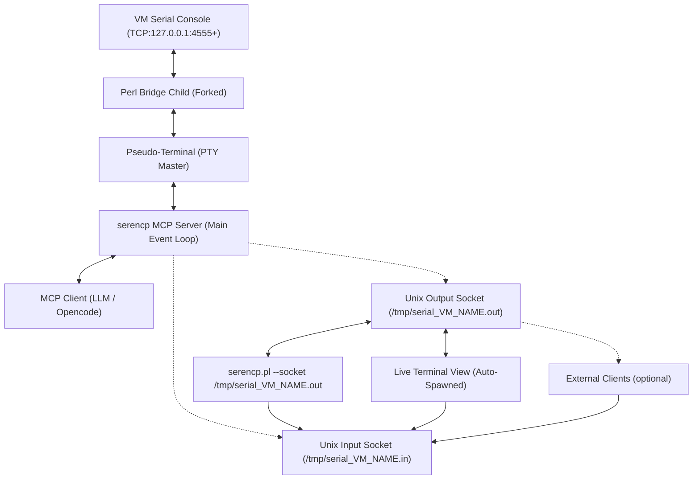
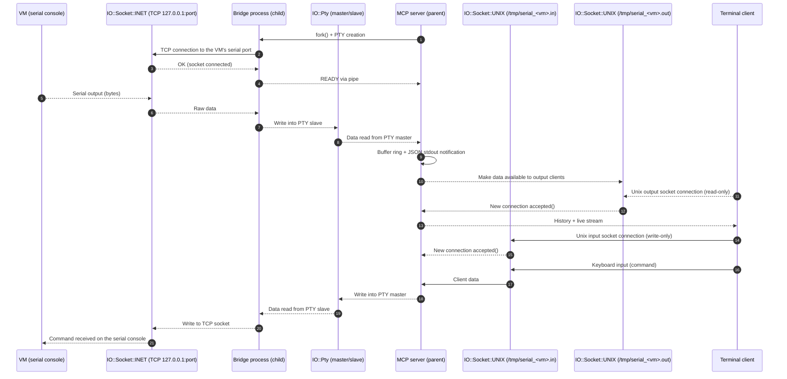

# SERENCP - VM Console MCP Server & live viewer Usage Guide

(tested with QEMU/KVM/virt-manager and OpenCode)

## Overview

The `serencp.pl` script provides a standard MCP (Model Context Protocol) server for bidirectional communication with VM serial consoles via an internal Perl-based socket bridge.

It uses `IO::Pty` to create a pseudo-terminal (PTY) for the VM serial console. It manages multiple VMs by assigning unique TCP ports for communication and provides a high-performance multiplexed event loop.

### Core Features:
- **Persistent PTY**: Maintains a stable connection to the VM serial console.
- **Auto-Restart with Exponential Backoff**: Automatically detects VM disconnects and restarts the bridge with intelligent exponential backoff (1s initial, 60s max) to prevent rapid reconnection storms.
- **Ring Buffer**: Maintains a ring buffer of the last 1000 lines of output (10MB max per VM).
- **Multi-Client Access**: Supports multiple simultaneous clients via dedicated Unix sockets for input (`/tmp/serial_${VM_NAME}.in`) and output (`/tmp/serial_${VM_NAME}.out`).
- **Standard MCP**: Supports standard `tools/list` and `tools/call` methods for tool discovery and execution.
- **Subscribe/Unsubscribe**: Control live VM output notifications with subscribe and unsubscribe tools.
- **Process Reaping**: Built-in SIGCHLD handler prevents zombie processes from forks.
- **Non-Blocking Write System**: Truly non-blocking writes with optional buffer queue for reliable data delivery.
- **Configurable Log Levels**: Debug, info, and error log levels with priority-based filtering.
- **Progress Notifications**: Supports MCP progress notifications for long-running operations.
- **Robust Cleanup**: END block ensures proper cleanup on abnormal exit (crash, _exit, die).

## Prerequisites
- **Operating System**: Strictly requires a *nix-like system (Linux, macOS, BSD, etc.). Windows is NOT supported (unless via WSL).
- Perl with `IO::Pty`, `JSON::PP`, `IO::Socket::INET`, and `Time::HiRes` modules installed.
- VM running with serial console on a TCP port (default starts at 4555).
- It does not require root permissions.
- **Automatic Terminal Feature**: Requires a supported terminal emulator to automatically spawn a window. It uses an internal client mode and does **not** require `socat`.
- **Command-Line Options**:
  - `--socket <path>`: Run in Unix socket client mode (connect to existing bridge) (don't care about it unless in non-MCP environement)
  - `--terminal <name>`: Specify preferred terminal emulator to use (bypasses auto-detection)

### Supported Terminal Emulators

The script automatically detects and supports the following terminal emulators (tested for availability at runtime):

**macOS (Priority):**
- `Ghostty.app` (GPU-accelerated)
- `WezTerm.app`
- `iTerm.app` / `iTerm2.app`
- `Terminal.app` (built-in macOS terminal)

**Modern Linux/Unix:**
- `wezterm` (cross-platform)
- `kitty` (GPU-accelerated, tested)
- `alacritty` (GPU-accelerated)
- `ghostty` (modern GPU-accelerated)
- `foot` (Wayland terminal)

**Mid-tier:**
- `konsole` (KDE)
- `gnome-terminal` (GNOME)
- `tilix` (GTK3 tiling terminal)
- `terminator` (advanced tiling terminal)
- `xfce4-terminal` (XFCE desktop)

**Legacy:**
- `xterm` (classic X11 terminal)
- `urxvt` (Unicode rxvt)

The script uses a priority-based detection system:
1. First honors user's explicit `--terminal` option
2. Then checks `TERM_PROGRAM` environment variable (macOS/VSCode/Warp/Hyper)
3. Then checks `TERMINAL` environment variable
4. Finally tries terminals in priority order until one works

The detection now performs a **test launch** to verify the terminal can actually spawn before selecting it, ensuring more reliable terminal spawning. If no terminal is detected, it provides fallback mechanisms and error notifications. It always prioritize best graphical terminal emulators.

## Configuration

### Default Constants (Version 1.1)
- **Default VM Port**: 4555
- **Ring Buffer Size**: 1000 lines
- **Max Buffer Bytes**: 10MB per VM
- **Console History Lines**: 60 lines (sent to new clients)
- **Read Timeout**: 2 seconds (internal, for legacy `read` tool)
- **Restart Backoff**: Initial 1s, Maximum 60s (exponential backoff)
- **Write Buffer**: 1MB max per destination
- **Protocol Version**: 2025-06-18

### MCP Server Configuration
Make sure the MCP server is configured in `opencode.jsonc`:
```json
"mcp": {
    "serencp": {
        "type": "local",
        "command": ["perl", "/path/to/serencp.pl"],
        "enabled": true
    }
}
```

You can also specify a terminal explicitly:
```json
"mcp": {
    "serencp": {
        "type": "local",
        "command": ["perl", "/path/to/serencp.pl","--terminal","wezterm"],
        "enabled": true
    }
}
```

**Make sure your guest OS is configured to use the serial console.**

GRUB example:

```bash
GRUB_CMDLINE_LINUX_DEFAULT="console=ttyS0,115200n8"
```
/etc/inittab example:

```bash
T0:23:respawn:/sbin/getty -L ttyS0 115200 vt100
```
systemd example:

```bash
systemctl enable serial-getty@ttyS0.service
systemctl start serial-getty@ttyS0.service
```

QEMU/KVM example XML config:

```xml
<serial type="tcp">
  <source mode="bind" host="127.0.0.1" service="4555" tls="no"/>
  <protocol type="raw"/>
  <target type="isa-serial" port="0">
    <model name="isa-serial"/>
  </target>
  <alias name="serial0"/>
</serial>
```

## Standard MCP Methods

### `tools/list`
Lists all available tools.
- **Request**: `{"jsonrpc": "2.0", "id": 1, "method": "tools/list"}`
- **Response**: List of tools with their input schemas.

### `tools/call`
Executes a specific tool.
- **Request Format**:
  ```json
  {
    "jsonrpc": "2.0",
    "id": 1,
    "method": "tools/call",
    "params": {
      "name": "tool_name",
      "arguments": { ... }
    }
  }
  ```

## Live Output Notifications

The server supports real-time VM output streaming through MCP protocol notifications. This provides immediate feedback without requiring polling.

The MCP client should use the `subscribe` tool to start receiving VM output notifications, and `unsubscribe` to stop receiving them.

### VM Output Notifications
VM output is automatically streamed as JSON-RPC 2.0 notifications using the MCP resources pattern:

```json
{
    "jsonrpc": "2.0",
    "method": "notifications/resources/updated",
    "params": {
        "uri": "vm://<vm_name>/output",
        "content": "output data here",
        "stream": "stdout"
    }
}
```

### Notification Parameters
- **uri**: Resource URI in the format `vm://<vm_name>/output`
- **content**: The actual output data (UTF-8 safe)
- **stream**: "stdout" or "stderr"

### Benefits
- **Real-time Feedback**: VM output appears immediately without polling
- **Efficient**: Push-based model reduces overhead compared to polling
- **UTF-8 Safe**: Binary data is converted to UTF-8 with escaped representations for non-printable characters
- **Backward Compatible**: Existing `read` tool continues to work for pull-based access
- **MCP Resources Pattern**: Uses standardized `notifications/resources/updated` for VM output
- **URI-based Access**: VM output accessible via `vm://<vm_name>/output` resource URI

### Log Level Control
The server supports configurable log levels: `debug`, `info`, and `error`. By default, debug logging is enabled.

## Available Tools

All tools include enhanced MCP annotations for better UI integration (title, readOnlyHint, destructiveHint, idempotentHint, openWorldHint).

The server provides 7 tools for VM serial console management:

### 1. `start`
Starts the bridge for a specific VM. If a bridge already exists, it is restarted to ensure a **clean slate** with fresh exponential backoff state.
**New behavior**: Automatically spawns a graphical terminal window linked to the session using the internal client of `serencp.pl`. The PID of this terminal is stored to avoid duplicate windows.
- **Arguments**: `{"vm_name": "string", "port": "number"}` (port is optional, default: 4555)
- **Returns**: `{"success": true, "message": "...", "port": 4555, "socket_in": "/tmp/serial_VM_NAME.in", "socket_out": "/tmp/serial_VM_NAME.out", "session_id": "session_...", "terminal_pid": 1234}`
- **Example**: `tools/call {"name": "start", "arguments": {"vm_name": "MYVM", "port": 4555}}`
- **Annotations**: Non-destructive, idempotent, open world

### 2. `status`
Checks the status of the bridge.
- **Arguments**: `{"vm_name": "string"}`
- **Returns**: `{"running": true/false, "vm_name": "...", "port": ..., "buffer_size": ...}`
- **Annotations**: Read-only, closed world

### 3. `read`
Reads all available output from the VM serial console's dedicated output Unix socket with a 2-second timeout. Live output is also streamed via notifications.
- **Arguments**: `{"vm_name": "string"}`
- **Returns**: `{"success": true, "output": "..."}`
- **Annotations**: Read-only, open world

### 4. `write`
Sends a command to the VM serial console via its dedicated input Unix socket.

- **Arguments**: `{"vm_name": "string", "text": "command"}`
- **Returns**: `{"success": true/false, "message": "..."}`
- **Example**: `tools/call {"name": "write", "arguments": {"vm_name": "MYVM", "text": "ls -l /"}}`
- **Annotations**: Non-destructive, non-idempotent, open world

### 5. `stop`
Stops the bridge for a specific VM, cleaning up all PTYs, child processes, and temporary Unix sockets.
- **Arguments**: `{"vm_name": "string"}`
- **Returns**: `{"success": true/false, "message": "..."}`
- **Annotations**: Destructive (stops bridge), idempotent, closed world

### 6. `subscribe`
Subscribe to live VM output notifications. Output is streamed via notifications/resources/updated in real-time.
- **Arguments**: `{"vm_name": "string"}`
- **Returns**: `{"success": true, "message": "Subscribed to VM output"}`
- **Annotations**: Non-destructive, idempotent, open world

### 7. `unsubscribe`
Unsubscribe from VM live output notifications.
- **Arguments**: `{"vm_name": "string"}`
- **Returns**: `{"success": true, "message": "Unsubscribed from VM output"}`
- **Annotations**: Non-destructive, idempotent, open world

## Architecture

The script connects to the VM serial console as a client and provides two Unix socket servers: one for input at `/tmp/serial_${VM_NAME}.in` and one for output at `/tmp/serial_${VM_NAME}.out`. It supports both an internal Unix socket client mode and automatic terminal spawning. The MCP server handles JSON-RPC commands and replies via MCP-compliant notifications.

#### Exponential Backoff Restart
When a VM disconnects, the bridge now uses exponential backoff to prevent reconnection storms:
- Initial backoff: 1 second
- Maximum backoff: 60 seconds
- Per-VM state tracking: Each VM maintains its own backoff timer
- Backoff resets on successful connection

#### Non-Blocking Write System
Version 1.1 introduces a truly non-blocking write system with three modes:
- **Mode 0 (Pure Non-Blocking)**: Returns immediately if would block
- **Mode 1 (Buffered)**: Queues data if can't write immediately
- **Mode 2 (Legacy)**: Retry with timeout (default for backward compatibility)
- Maximum write buffer: 1MB per destination
- Automatic buffer flushing in the event loop

#### Enhanced UTF-8 Handling
- Binary data from VM is converted to UTF-8 safely
- Non-printable characters are escaped for JSON transport
- Preserves data integrity while ensuring JSON compatibility

### Internal Unix Socket Client Mode
The script can be run in client mode to connect to an existing bridge:
```bash
./serencp.pl --socket /tmp/serial_${VM_NAME}.out
```

This mode provides direct terminal access to the VM serial console through the Unix socket interface.

### Explicit Terminal Selection
You can explicitly specify which terminal to use:
```bash
./serencp.pl --terminal wezterm
```

This bypasses automatic detection and uses the specified terminal.



The parent MCP server uses `IO::Select` to multiplex:
1. `STDIN`: JSON-RPC commands from the LLM or Opencode.
2. `PTY Master`: Real-time data from/to the VM via the child bridge.
3. `Unix Input/Output Sockets`: Listeners for external terminal connections.
4. `Unix Clients`: Active terminal sessions connected to the Unix sockets.

When the VM disconnects, the parent detects the PTY closure and automatically restarts the bridge child to maintain persistence.

## Sequence Diagram



### Terminal Access
For direct interaction outside of the MCP environment, you can use the script itself as a client by specifying the output socket:
```bash
./serencp.pl --socket /tmp/serial_${VM_NAME}.out
```
New output connections automatically receive the last 60 lines of history. Live output notifications are sent automatically when VM data is received, providing real-time streaming without polling. To send input, the client automatically opens and writes to the corresponding input socket (`/tmp/serial_${VM_NAME}.in`).

## Troubleshooting
- **No terminal window is opened**: If the automatic terminal spawning fails, first check if graphical apps can be launched from a root terminal (e.g : `pluma`)
Then check the following environment variables are properly set:
  - **XAUTHORITY**: Required for X11 authentication (e.g., `/root/.Xauthority`)
  - **XDG_RUNTIME_DIR**: Should be set to the user's runtime directory (e.g., `/run/user/0`)
  - **DBUS_SESSION_BUS_ADDRESS**: Required for D-Bus session communication

  To fix these issues, run the script from a proper X11 session where these variables are automatically set, or export them manually:
  ```bash
  export XAUTHORITY=/root/.Xauthority
  export XDG_RUNTIME_DIR=/run/user/0
  ```

- **Terminal detection fails**: Use the `--terminal` option to explicitly specify your terminal emulator:
  ```bash
  ./serencp.pl --terminal wezterm
  ```

- **Failed to get tools**: Ensure the script is run in an environment where standard input/output is captured. Use `tools/list` to verify connectivity.
- **Bridge not running**: Call `start` before attempting to read or write.
- **No live notifications**: Ensure your MCP client supports notification handling. Notifications are sent automatically when VM output is received.
- **Socket Permission**: Ensure `/tmp` is writable by the user running the MCP server.
- **Syntax Check**: Run `perl -c serencp.pl` to verify script integrity.
- **Write buffer full**: If you see "Write buffer full" warnings, the destination is not keeping up with data. This is normal during high-throughput scenarios and data will be dropped.
- **Exponential backoff active**: If the bridge keeps restarting, you'll see increasing delays between reconnection attempts (1s, 2s, 4s... up to 60s). This is intentional to prevent connection storms.

## About

The name `serencp` is a play on words:
- `seren` - Serenity / Serial
- `cp` - MCP (Model Context Protocol)

## Feel free to contribute

Since it's a complex script, your help / pull requests are much appreciated !